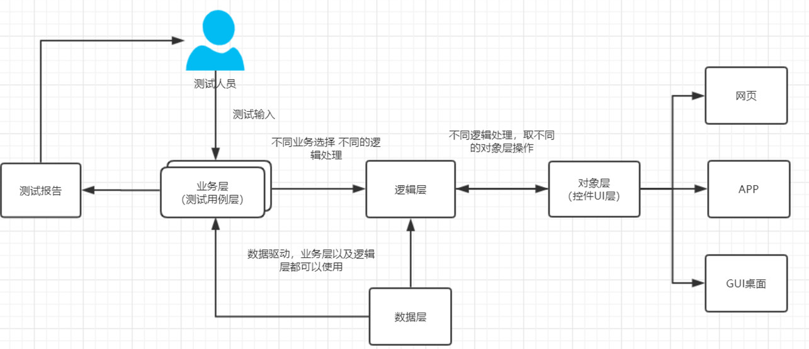

# Python_Automation 自动化锦集

> 1. page_object 模式
```
Page object 是selenium自动化测试项目开发实践的最佳设计之一。
旨在使测试人员只关注业务层面，对于具体的实现方法不需要过多
的去操心，并且分层的设计，使每一个层面都能关注到自己的实现。

PageObject可以通过分层进行设计
每一层有着每一层的分工，然后不同层的执行可以产生一个新的测试的共同目标。
一般可以分为3层
	1.对象库层
	2.逻辑层
	3.业务层

如果测试的数据大，可以加上一个数据层
	1.对象库层
	2.逻辑层
	3.业务层
	4.数据层

PageObject的模式大致如下：

```


